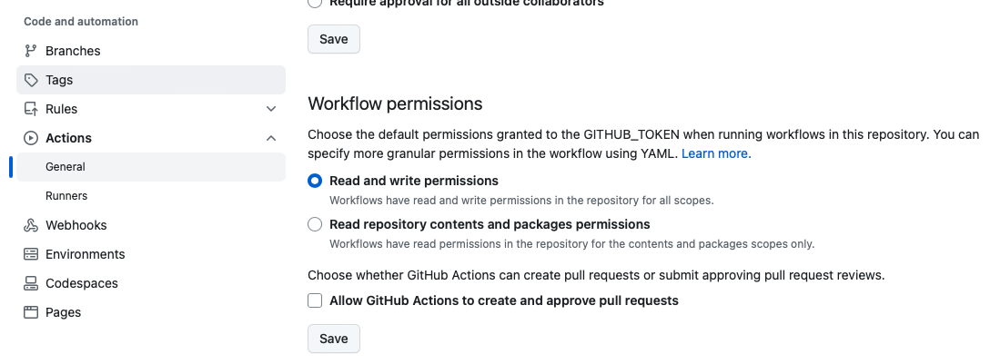
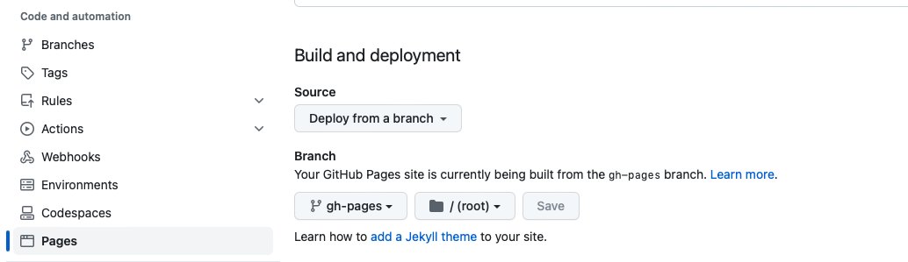

# Vuepress Actions Template

Vuepress 的 Github Pages 模板，使用 Github Actions 持续集成

Github Pages template for Vuepress, Continuous Integration(CI) with Github Actions

使用 yarn 作为包管理工具

文档 

## 使用

```shell
# Https
git clone https://github.com/HenryZhuHR/vuepress-actions-template.git
# Or SSH
git clone git@github.com:HenryZhuHR/vuepress-actions-template.git
```

本地预览文档
```shell
yarn docs:dev
```
本地编译文档
```shell
yarn docs:build
```

修改配置 `.github/workflows/docs.yarn.yml`
- **CI 流程触发**: `on` -> `push` -> `branches` 修改为触发 CI 流程的分支，默认为 `main`
- **部署分支**: `jobs` -> `docs` -> `steps` -> `Deploy to GitHub Pages` -> `target_branch`，将编译的文档部署到指定分支，默认为 `gh-pages`

Github 上配置 Github Pages 相关流程，在项目的 `Settings` 中
1. `Actions` -> `general` 中设置 Actions permissions ，修改 Workflow permissions 中，勾选 `Read and write permissions` 使得 actions 可以推送到分支 `gh-pages`(或者自定义的部署分支)
   


2. `Pages` -> `Source` 中 `Deploy from a branch`，然后 `Branch` 选择 `gh-pages`(或者自定义的部署分支)

